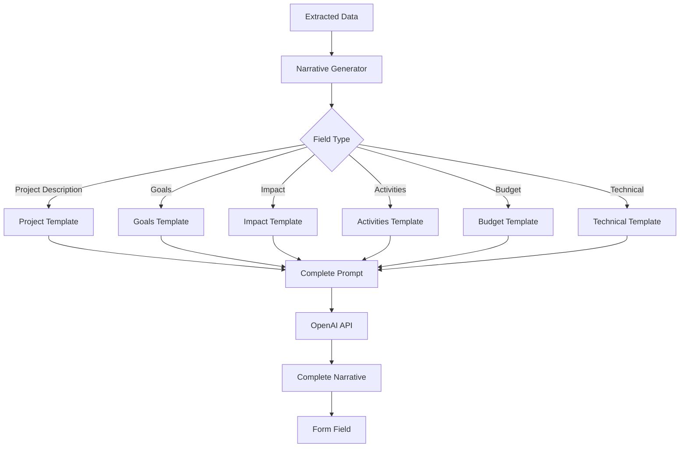

# OpenAI Narrative Generation with Complete Templates

## Overview
Enhance the grant application automation system to use OpenAI API for generating complete narrative prose from extracted data. Each narrative generation function will have comprehensive templates that ensure all business data is captured, in scope, and produces unique, complete narratives tailored to the specific grant application.

## Architecture



## Implementation Steps

### 1. Create Narrative Generator Service with Complete Templates
**File:** `agents/grant_scraper/narrative_generator.py`

Create `NarrativeGenerator` class with comprehensive template system:

#### Template Structure
Each template will include:
- **Context Section**: Organization info, grant details, project overview
- **Data Section**: All relevant extracted data for the field
- **Instructions Section**: Specific formatting and style requirements
- **Scope Section**: What must be included to be "complete"
- **Uniqueness Section**: How to make it unique to this organization/grant

#### Narrative Generation Methods with Complete Templates

**1. `generate_project_description()` - Project Narrative Template**
```python
PROJECT_DESCRIPTION_TEMPLATE = """
You are writing a comprehensive project description for a grant application to {grant_name}.

ORGANIZATION CONTEXT:
- Organization Name: {organization_name}
- Mission: {organization_mission}
- Tax Status: {tax_status}
- Founded: {founded_year}
- Annual Budget: ${annual_budget:,.2f}
- Target Audience: {target_audience}

PROJECT DATA TO INCLUDE:
- Project Title: {project_title}
- Project Description: {project_description}
- Project Goals: {project_goals}
- Target Audience: {target_audience}
- Geographic Scope: {geographic_scope}
- Timeline: {timeline}
- Expected Participants: {expected_participants}

GRANT CONTEXT:
- Grant Name: {grant_name}
- Grant Deadline: {deadline}
- Grant Focus Areas: {grant_focus}
- Grant Amount Requested: ${budget_total:,.2f}

REQUIREMENTS FOR COMPLETE NARRATIVE:
1. Must include organization's mission and how project aligns
2. Must describe the specific problem or need being addressed
3. Must explain the project's approach and methodology
4. Must detail the target population and their needs
5. Must describe expected outcomes and impact
6. Must explain how this project is unique to your organization
7. Must connect project to grant's focus areas
8. Must include specific metrics and measurable goals
9. Must describe sustainability and long-term impact
10. Must explain community partnerships and collaboration

STYLE REQUIREMENTS:
- Write in professional grant writing style
- Use complete sentences and paragraphs (NO bullet points)
- Write in third person about the organization
- Use active voice where appropriate
- Include specific details, numbers, and concrete examples
- Length: 500-1000 words for comprehensive description
- Flow naturally from problem to solution to impact

UNIQUENESS REQUIREMENTS:
- Incorporate specific details about {organization_name}
- Reference specific programs, partnerships, or achievements
- Include organization-specific metrics and outcomes
- Connect to organization's unique mission and approach
- Reference specific community needs and context
- Include unique aspects of this project that differentiate it

Generate a complete, unique project description that incorporates ALL of the above information in a flowing narrative format with NO bullet points.
"""
```

**2. `generate_goals_narrative()` - Goals Narrative Template**
```python
GOALS_NARRATIVE_TEMPLATE = """
You are writing project goals for a grant application to {grant_name}.

ORGANIZATION CONTEXT:
- Organization: {organization_name}
- Mission: {organization_mission}

PROJECT CONTEXT:
- Project Title: {project_title}
- Project Description: {project_description}
- Grant Amount: ${budget_total:,.2f}

GOALS DATA TO INCLUDE:
{goals_list}

Each goal should be expanded into a complete narrative that includes:
- The specific objective
- Why this goal is important
- How it will be achieved
- Who will benefit
- How success will be measured
- Timeline for achievement

REQUIREMENTS FOR COMPLETE NARRATIVE:
1. Convert each goal into a complete paragraph (not a list)
2. Explain the rationale and importance of each goal
3. Connect goals to organization's mission
4. Show how goals align with grant objectives
5. Include measurable outcomes for each goal
6. Explain how goals build upon each other
7. Describe the target population for each goal
8. Include specific metrics and success indicators
9. Explain long-term impact of achieving goals
10. Show how goals address community needs

STYLE REQUIREMENTS:
- Write in flowing prose (NO bullet points, NO numbered lists)
- Use complete sentences and paragraphs
- Each goal should be 2-4 sentences explaining the objective
- Connect goals with transitional phrases
- Use professional grant writing language
- Total length: 300-600 words depending on number of goals

UNIQUENESS REQUIREMENTS:
- Reference {organization_name}'s specific approach
- Include organization-specific metrics and targets
- Connect to organization's unique programs
- Reference specific community context
- Include unique aspects of how goals will be achieved

Generate a complete narrative that incorporates ALL goals into flowing prose with NO bullet points or lists.
"""
```

**3. `generate_impact_narrative()` - Impact Narrative Template**
```python
IMPACT_NARRATIVE_TEMPLATE = """
You are writing about project impact for a grant application to {grant_name}.

ORGANIZATION CONTEXT:
- Organization: {organization_name}
- Years of Operation: {years_operating}
- Current Reach: {current_reach}
- Previous Impact: {previous_impact}

PROJECT CONTEXT:
- Project Title: {project_title}
- Target Population: {target_audience}
- Geographic Scope: {geographic_scope}

IMPACT DATA TO INCLUDE:
- Expected Outcomes: {expected_outcomes}
- Metrics: {impact_metrics}
- Target Numbers: {target_numbers}
- Previous Results: {previous_results}
- Community Impact: {community_impact}

REQUIREMENTS FOR COMPLETE NARRATIVE:
1. Describe both quantitative and qualitative impact
2. Include specific metrics and numbers
3. Explain impact on target population
4. Describe community-wide effects
5. Include short-term and long-term impact
6. Explain how impact will be measured
7. Reference previous successful outcomes
8. Describe transformative potential
9. Include impact on underserved populations
10. Explain sustainability of impact

STYLE REQUIREMENTS:
- Write in professional narrative style (NO bullet points)
- Use complete sentences and paragraphs
- Incorporate metrics naturally into prose
- Use specific numbers and percentages
- Write in third person
- Length: 400-700 words
- Flow from immediate to long-term impact

UNIQUENESS REQUIREMENTS:
- Reference {organization_name}'s track record
- Include organization-specific impact metrics
- Connect to organization's unique mission
- Reference specific community needs addressed
- Include unique aspects of impact measurement

Generate a complete impact narrative incorporating ALL metrics and outcomes in flowing prose with NO bullet points.
"""
```

**4. `generate_activities_narrative()` - Activities Narrative Template**
```python
ACTIVITIES_NARRATIVE_TEMPLATE = """
You are writing about project activities for a grant application to {grant_name}.

ORGANIZATION CONTEXT:
- Organization: {organization_name}
- Expertise Areas: {expertise_areas}
- Program Experience: {program_experience}

PROJECT CONTEXT:
- Project Title: {project_title}
- Project Duration: {project_duration}
- Target Participants: {target_participants}

ACTIVITIES DATA TO INCLUDE:
{activities_list}

Each activity should be described as a complete narrative including:
- What will be done
- Who will participate
- When and where it occurs
- How it will be implemented
- Resources needed
- Expected outcomes from activity

REQUIREMENTS FOR COMPLETE NARRATIVE:
1. Convert each activity into complete paragraph(s)
2. Describe the activity in detail
3. Explain who will participate and why
4. Describe the methodology or approach
5. Include timeline and frequency
6. Explain resources and materials needed
7. Connect activity to project goals
8. Describe expected outcomes from activity
9. Explain how activities build upon each other
10. Include staff/volunteer roles

STYLE REQUIREMENTS:
- Write in flowing narrative style (NO bullet points, NO lists)
- Use complete sentences and paragraphs
- Describe activities as ongoing processes
- Use active voice
- Include specific details and examples
- Length: 500-800 words depending on number of activities
- Flow chronologically or thematically

UNIQUENESS REQUIREMENTS:
- Reference {organization_name}'s specific methods
- Include organization-specific program elements
- Connect to organization's expertise
- Reference unique partnerships or approaches
- Include specific community context

Generate a complete activities narrative incorporating ALL activities in flowing prose with NO bullet points or lists.
"""
```

**5. `generate_budget_narrative()` - Budget Narrative Template**
```python
BUDGET_NARRATIVE_TEMPLATE = """
You are writing a budget narrative for a grant application to {grant_name}.

ORGANIZATION CONTEXT:
- Organization: {organization_name}
- Annual Budget: ${annual_budget:,.2f}
- Financial Stability: {financial_stability}

PROJECT CONTEXT:
- Project Title: {project_title}
- Total Requested: ${budget_total:,.2f}
- Project Duration: {project_duration}
- Matching Funds: {matching_funds}

BUDGET DATA TO INCLUDE:
- Total Request: ${budget_total:,.2f}
- Line Items: {budget_line_items}
- Budget Breakdown: {budget_breakdown}
- Matching Funds: {matching_funds_percentage}%
- In-Kind Contributions: {in_kind_contributions}

REQUIREMENTS FOR COMPLETE NARRATIVE:
1. Explain the total budget request and its justification
2. Describe each major budget category in detail
3. Explain costs for personnel, equipment, materials, etc.
4. Justify each expense as necessary for project success
5. Explain cost-effectiveness and value
6. Describe matching funds and their sources
7. Explain in-kind contributions
8. Show budget aligns with project activities
9. Explain sustainability and long-term funding
10. Include budget timeline and spending plan

STYLE REQUIREMENTS:
- Write in professional narrative style (NO bullet points, NO tables)
- Use complete sentences and paragraphs
- Incorporate dollar amounts naturally into prose
- Explain costs in context of project goals
- Use third person
- Length: 400-600 words
- Flow from total to categories to justification

UNIQUENESS REQUIREMENTS:
- Reference {organization_name}'s financial practices
- Include organization-specific cost structures
- Reference unique partnerships that reduce costs
- Include specific vendor or service details
- Connect to organization's efficiency

Generate a complete budget narrative incorporating ALL budget information in flowing prose with NO bullet points or tables.
"""
```

**6. `generate_technical_narrative()` - Technical Narrative Template**
```python
TECHNICAL_NARRATIVE_TEMPLATE = """
You are writing technical specifications for a grant application to {grant_name}.

ORGANIZATION CONTEXT:
- Organization: {organization_name}
- Technical Expertise: {technical_expertise}
- Current Infrastructure: {current_infrastructure}

PROJECT CONTEXT:
- Project Title: {project_title}
- Technical Requirements: {technical_requirements}
- Equipment Needs: {equipment_needs}

TECHNICAL DATA TO INCLUDE:
- Specifications: {technical_specifications}
- Equipment List: {equipment_list}
- Infrastructure Needs: {infrastructure_needs}
- Technical Requirements: {technical_requirements}
- Integration Needs: {integration_needs}

REQUIREMENTS FOR COMPLETE NARRATIVE:
1. Describe technical infrastructure comprehensively
2. Explain equipment specifications and rationale
3. Describe how technology supports project goals
4. Explain technical requirements and standards
5. Describe integration with existing systems
6. Explain technical support and maintenance
7. Include capacity and scalability considerations
8. Describe security and data privacy measures
9. Explain technical training needs
10. Include technical timeline and implementation

STYLE REQUIREMENTS:
- Write in professional technical narrative style (NO bullet points)
- Use complete sentences and paragraphs
- Explain technical terms in context
- Describe equipment and systems naturally
- Use third person
- Length: 500-700 words
- Flow from overview to specifics to implementation

UNIQUENESS REQUIREMENTS:
- Reference {organization_name}'s technical capabilities
- Include organization-specific technical needs
- Connect to organization's existing systems
- Reference unique technical partnerships
- Include specific technical context

Generate a complete technical narrative incorporating ALL technical information in flowing prose with NO bullet points or lists.
```
"""

### 2. Template Data Collection
Each template method must:
- Collect ALL relevant data from extracted grant data
- Include organization context
- Include project context
- Include grant-specific context
- Handle missing data gracefully (use placeholders or skip sections)

### 3. Template Prompt Building
Create `_build_narrative_prompt()` method that:
- Takes template string and data dictionary
- Fills in all template variables
- Handles missing data (uses "Not specified" or skips section)
- Validates required data is present
- Adds system instructions for OpenAI

### 4. OpenAI API Integration
Each generation method will:
- Build complete prompt from template
- Call OpenAI API with appropriate parameters
- Validate response (no bullet points, complete sentences)
- Post-process if needed (remove any accidental formatting)
- Return complete narrative

### 5. Integration with Form Mapper
**File:** `agents/grant_scraper/form_mapper.py`

- Add `narrative_generator` parameter to `__init__()`
- In `map_data_to_fields()`, for each textarea field:
  - Check if field should use narrative (from config)
  - Check if value contains bullet points or is structured
  - Call appropriate narrative generation method
  - Replace value with generated narrative
- Cache generated narratives to avoid duplicate API calls

### 6. Configuration Updates
**File:** `agents/grant_scraper/grant_config.yaml`

Add comprehensive narrative generation configuration:
```yaml
narrative_generation:
  enabled: true
  openai_api_key: null  # Uses environment or config default
  model: "gpt-4"
  temperature: 0.7
  max_tokens: 2000
  
  # Field-specific narrative settings
  fields_to_narrate:
    project_description:
      enabled: true
      template: "project_description"
      min_words: 500
      max_words: 1000
    project_goals:
      enabled: true
      template: "goals"
      min_words: 300
      max_words: 600
    project_impact:
      enabled: true
      template: "impact"
      min_words: 400
      max_words: 700
    project_activities:
      enabled: true
      template: "activities"
      min_words: 500
      max_words: 800
    budget_breakdown:
      enabled: true
      template: "budget"
      min_words: 400
      max_words: 600
    technical_specifications:
      enabled: true
      template: "technical"
      min_words: 500
      max_words: 700
  
  # Template customization
  include_organization_context: true
  include_grant_context: true
  emphasize_uniqueness: true
  require_metrics: true
```

### 7. Update Automation Workflow
**File:** `agents/grant_scraper/automation_workflow.py`

- Initialize `NarrativeGenerator` when enabled
- Pass to `FormMapper` during initialization
- Add narrative generation step before form mapping
- Log narrative generation activity
- Track which fields used narratives vs. original data

### 8. Update CLI
**File:** `agents/grant_scraper/cli.py`

- Add `--use-narratives` flag
- Add `--openai-api-key` option
- Add `--narrative-model` option
- Display narrative generation progress
- Show which fields were converted to narratives

## Template Completeness Requirements

Each template must ensure:
1. **All Data Captured**: Every piece of relevant extracted data is included
2. **Complete Scope**: Narrative addresses all required aspects
3. **Uniqueness**: Incorporates organization-specific details
4. **Grant Alignment**: Connects to grant's focus areas
5. **Professional Quality**: Grant-appropriate writing style
6. **No Formatting**: No bullet points, lists, or tables
7. **Appropriate Length**: Meets form field requirements
8. **Context Rich**: Includes organization and grant context
9. **Metrics Included**: Incorporates all numbers and statistics
10. **Flow and Coherence**: Reads as natural prose

## Error Handling

- Missing data: Use placeholders or skip sections gracefully
- API failures: Fallback to original data with warning
- Rate limiting: Implement retry with exponential backoff
- Invalid response: Validate and regenerate if needed
- Timeout: Set reasonable timeout, fallback to original
- Quality check: Verify no bullet points, complete sentences

## Testing Strategy

1. Test each template with complete data
2. Test each template with missing data
3. Verify no bullet points in output
4. Verify all data is included
5. Verify uniqueness and customization
6. Test error handling scenarios
7. Verify narrative quality and appropriateness
8. Test with different grant types

## Key Files to Create/Modify

- `agents/grant_scraper/narrative_generator.py` - Complete narrative generator with all templates
- `agents/grant_scraper/form_mapper.py` - Integrate narrative generation
- `agents/grant_scraper/grant_config.yaml` - Add narrative configuration
- `agents/grant_scraper/automation_workflow.py` - Add narrative generation step
- `agents/grant_scraper/cli.py` - Add narrative options
- `agents/grant_scraper/__init__.py` - Export NarrativeGenerator